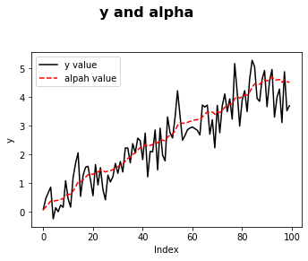

# TimeSeries pdf Python implementation

## Simple linear regression model


```python
import numpy as np
import matplotlib.pyplot as plt
```


```python
import numpy as np
np.random.seed(2)
x = np.random.chisquare(6,40)
e = np.random.normal(0,1,40)
y = 1.3+0.8*x+e
f = 1.3+0.8*np.array(range(1,22))
plt.xlabel('x')
plt.ylabel('y')
plt.suptitle('What is the relation between x and y?', fontsize=16, fontweight='bold')
plt.subplots_adjust(left=0.2, wspace=0.8, top=0.8)  # 位置调整
plt.scatter(x,y, color='red')
plt.plot(f, color='black',linewidth=1)
plt.show()
```


### Suppose we ask 200 clients (both female and male) to express their appreciation for the beer for each temperature included beteen 2 degres and 12 degrees Celsius. The chunk below is a simulation: 


```python
n=200
np.random.seed(6)
gender=np.array([round(i,0) for i in np.random.uniform(0,1,n)])
temperature=2+np.arange(0.0,9.99,.05)
ef = 0.4*np.random.normal(0,1,n)
em = 0.8*np.random.normal(0,1,n)
appreciation=np.zeros(n)
for i in range(n):
    if gender[i]==0:
        appreciation[i]=7-0.3*temperature[i]+ef[i]
    else:
        appreciation[i]=10-0.7*temperature[i]+em[i]
fig = plt.figure(figsize=(12,6))
ax1 = fig.add_subplot(1,2,1)
ax1.scatter(temperature,appreciation,s=15,marker='o',color='black')
plt.xlabel('temperature')
plt.ylabel('appreciation')
ax2 = fig.add_subplot(1,2,2)
ax2.scatter(temperature,appreciation,marker='o',c=gender,s=15,cmap='brg')
labels = ['Female', 'Male']
plt.xlabel('temperature')
plt.ylabel('appreciation')
plt.show()
```


### extract the errors or the residuals of your regression you have to type:


```python
from sklearn import linear_model
n=200
np.random.seed(134)
gender=np.array([round(i,0) for i in np.random.uniform(0,1,n)])
temperature=2+np.arange(0.0,9.99,.05)
ef = 0.4*np.random.normal(0,1,n)
em = 0.8*np.random.normal(0,1,n)
appreciation=np.zeros(n)
for i in range(n):
    if gender[i]==0:
        appreciation[i]=7-0.3*temperature[i]+ef[i]
    else:
        appreciation[i]=10-0.7*temperature[i]+em[i]
yy= np.array(appreciation)[gender==0]
xx = temperature[gender==0]
model = linear_model.LinearRegression()
model.fit(xx.reshape(-1, 1),yy.reshape(-1, 1))
pre_yy = model.predict(xx.reshape(-1, 1))
redis= yy.reshape(-1, 1) - pre_yy
plt.hist(redis,bins=40,color='green')
plt.xlabel('residual_error')
plt.ylabel('frequency')
plt.title('histogram of residuals')
plt.show()
```


### Linear regression analysis can use more than one variables (more than one X). Suppose in the previous example we also record the age of the client, using this simulation:


```python

```


```python
import pandas as pd
n=200
np.random.seed(6)
gender=np.array([round(i,0) for i in np.random.uniform(0,1,n)])
trans_dict = {0:'Female',1:'Male'}
sex=np.array(['Female']*len(gender))
sex[gender==1]='Male'
temperature=2+np.arange(0.0,9.99,.05)
age = np.random.chisquare(5,n)
ef = 0.4*np.random.normal(0,1,n)
em = 0.8*np.random.normal(0,1,n)
appreciation=np.zeros(n)
for i in range(n):
    if gender[i]==0:
        appreciation[i]=7-0.3*temperature[i]+ef[i]
    else:
        appreciation[i]=10-0.7*temperature[i]+em[i]
df = pd.DataFrame()
df['gender'] = gender
df['age'] = age
df['temperature'] = temperature
df['appreciation'] = appreciation
dataset = df[gender==0]
train_x = dataset[['age','temperature']].values
train_y = dataset['appreciation'].values
model = linear_model.LinearRegression()
model.fit(train_x,train_y)
predict = model.predict(train_x)
print(predict)
```

    [6.37673528 6.45381    6.43899934 6.36261222 6.33810698 6.30619733
     6.0671895  6.06038316 6.12696913 6.10461927 5.78213252 6.02771733
     5.95215068 5.89643727 5.90600957 5.65124951 5.65152092 5.70307183
     5.70370122 5.67938609 5.70297129 5.47324941 5.54665212 5.69226834
     5.29563095 5.45604101 5.46939593 5.34390642 5.44915703 5.34484674
     5.41389015 5.10584441 5.16560677 5.21131769 5.28972956 5.1813024
     5.11911913 4.93472026 5.12756751 5.01612837 4.91129946 4.95236487
     4.93283734 4.83684464 4.77048075 4.86749892 4.77076155 4.62924516
     4.75678083 4.45274838 4.69562115 4.28723671 4.54339749 4.35993847
     4.58002524 4.30807059 4.43946664 4.51260372 4.37299547 4.49542395
     4.46989729 4.4352     4.32782253 4.22098466 4.24483623 4.36676389
     4.252908   4.30937196 4.19379865 4.04495523 4.13352968 4.11725629
     3.90023013 4.0980172  4.00213932 3.95855367 3.96155949 3.95894951
     3.95131117 3.83835672 3.91638238 3.86243338 3.76891547 3.82073034
     3.72671901 3.80341358 3.74822763 3.64999213 3.67611458 3.36446727
     3.49939726 3.41062878 3.4189591  3.59272536 3.56873812 3.35295728
     3.3249088  3.35861882 3.41033169 3.46995057 3.31838801]


### Exercise Restaurant


```python
n=1000
card = np.array([round(i,0) for i in np.random.uniform(0,1,n)])
CreditCard = np.array(["Card"]*len(card))
CreditCard[card==1] = "Cash"
spending = 19+np.random.chisquare(8,n)
day=np.zeros(n)
sex=np.zeros(n)
timing=np.zeros(n)
age=np.zeros(n)
for i in range(n):
    if spending[i]<28:
        sex[i]=int(round(np.random.uniform(0,1,1)[0],0))
        timing[i]=40+np.random.chisquare(8,1)[0]
        age[i]=int(round(25+np.random.chisquare(3,1)[0],0))
        day[i]=1+3*int(round(np.random.uniform(0,1,1)[0],0))
    else:
        sex[i]=1
        timing[i]=90+np.random.chisquare(10,1)[0]
        age[i]=int(round(45+np.random.chisquare(6,1)[0],0))
        day[i]=int(round(45+np.random.uniform(1,2,4)[0],0))
Resto = pd.DataFrame()
Resto['spending']  = age
Resto['day'] = day
Resto['sex'] = sex
Resto['CreditCard'] = CreditCard
Resto['timing'] = timing
day_list = list(set(day))
label=["Mon-Thu","Fri","Sat","Sun"]
dic = dict(zip(day_list,label))
Resto['day']=Resto['day'].map(dic)
print(Resto)
```

         spending      day  sex CreditCard      timing
    0        48.0      Sun  1.0       Cash   95.959807
    1        31.0      Fri  0.0       Card   43.374533
    2        31.0  Mon-Thu  0.0       Card   43.053786
    3        54.0      Sat  1.0       Cash   95.467297
    4        50.0      Sun  1.0       Card   98.498566
    ..        ...      ...  ...        ...         ...
    995      26.0      Fri  1.0       Cash   49.656244
    996      51.0      Sun  1.0       Cash   97.501375
    997      27.0      Fri  1.0       Cash   46.370536
    998      46.0      Sun  1.0       Card  107.109616
    999      26.0      Fri  0.0       Card   51.179144
    
    [1000 rows x 5 columns]


## Optim-ization with python

### finding the law expressed in the previous expression.


```python
from scipy.optimize import minimize_scalar
np.random.seed(245)
n = 100
x = np.random.uniform(1,8,n)
y = 1+np.random.normal(0,1,n)
plt.scatter(x,y)
plt.show()
def myfu(beta):
    b = beta
    e = y-b*x
    a = sum(e**2)
    return a
res = minimize_scalar(myfu,bounds=(0,3),method = "Brent")
print(res)
```


         fun: 129.75861794464265
        nfev: 9
         nit: 5
     success: True
           x: 0.17834451595218748

### a kinds of code runs a for loop before providing the element we want to minimize


```python
n=100
def myfu(beta):
    e=[]
    b = beta
    for i in range(n):
        e.append(y[i]-b*x[i])
    e=np.array(e)
    a = sum(e**2)
    return a
res1 = minimize_scalar(myfu,bounds=(0,3),method = "Brent")
print(res1)
```

         fun: 233.39048891071448
        nfev: 9
         nit: 5
     success: True
           x: 0.2394738418923565

### Exercise (unidimensional)


```python
np.random.seed(5345)
x = np.array([math.sin(i) for i in np.arange(0.01,1,0.01)])
b = np.random.uniform(0,1,1)[0]
y = -b*x+0.03*np.random.normal(0,1,len(x))
plt.scatter(x,y)
plt.show()
```


### have some fun by visualizing this z function as above.


```python
from mpl_toolkits.mplot3d import Axes3D
fig = plt.figure()
ax= Axes3D(fig)
x = np.linspace(-5,10,50)
y = np.linspace(-11,2,50)
x,y=np.meshgrid(x,y)
z = (-2+x)**2+(4+y)**2
ax.plot_surface(x,y,z,rstride=1,cstride=1,cmap='hot')
plt.show()
ax.contour(x, y, z, offset=-2, colors='yellow')
fig=plt.figure()
bx=fig.add_subplot(111)
C=bx.contour(x,y,z)
bx.clabel(C,inline=True,fontsize=12)
ax.set_zlim(-3,3)
plt.show()
```


## The Normal distribution

### generete a normal distribution with mean 0.2 and variance 1.5


```python
x=np.linspace(-3.8,4.2,800)
mu=0.2
sigma=np.sqrt(1.5)
pdf=np.zeros(len(x))
cdf=np.zeros(len(x))
for i in range(len(x)):
    pdf[i] = (1/np.sqrt(2*np.pi*sigma**2))*np.exp(-.5*((x[i]-mu)**2/sigma**2))
    cdf[i]=round(sum(pdf[:i])/100,4)
fig = plt.figure()
ax1 = fig.add_subplot(2,2,1)
ax1.set_title("Probability distribution function")
plt.plot(pdf,'#000000')
ax2 = fig.add_subplot(2,2,2)
ax2.set_title("Cumulative distribution function")
plt.plot(cdf,'#000000')
plt.show()
```

### draw pdf of the bivariate normal


```python
import numpy as np
import matplotlib.pyplot as plt
from mpl_toolkits.mplot3d import Axes3D
e = np.random.randn(10000000, 2)
N = 30
density, edges = np.histogramdd(e, bins=[30, 30])
density = density/density.max()
x = y = np.arange(N)
t = np.meshgrid(x,y)
fig = plt.figure()
ax = Axes3D(fig)
ax.scatter(t[0], t[1], density, c='r', s=15*density, marker='o', depthshade=True)
ax.plot_surface(t[0], t[1], density, cmap='rainbow', rstride=1, cstride=1, alpha=0.9, lw=1)
ax.set_xlabel("x")
ax.set_ylabel("y")
ax.set_zlabel("z")
plt.title("2-dim Normal")
plt.tight_layout(0.1)
plt.show()
```

    C:\Users\HP\Anaconda3\lib\site-packages\ipykernel_launcher.py:18: UserWarning: This figure includes Axes that are not compatible with tight_layout, so results might be incorrect.


## State-Space models and the Kalman filter

### Kalman filter example


```python
import numpy as np
import math
import matplotlib.pyplot as plt
##状态转移函数
def change(i):
    dy = alpha[i-1]+e[i]
    y.append(dy)
    dalpha  = 0.9*alpha[i-1]+u[i]
    alpha.append(dalpha)
    dk =(z*w * p[i-1]) / (z**2 * p[i-1] + sigmae)
    k.append(dk)
    dp =w**2* p[i-1] - w*z*k[i-1]*p[i-1]+ sigmau
    p.append(dp)
    dv =y[i]- z*a[i-1]
    v.append(dv)
    da =w*a[i-1]+ k[i-1]*v[i-1]
    a.append(da)
np.random.seed(1123)
n=100
sigmae=0.8;sigmau=0.4;w=0.9;z=1
k=[]
v=[]
e = np.random.normal(loc=0, scale=math.sqrt(0.8), size=n)
u = np.random.normal(loc=0, scale=math.sqrt(0.4), size=n)
y=[e[0]]
alpha=[u[0]]
a=[0]
p=[2.11]
for i in range(1,n):
    change(i)
plt.ylabel('cbind(y, alpha, a)')
plot1=plt.plot(y,'#000000',label="y value")
plot2=plt.plot(alpha,'-r',label="alpah value")
plot3=plt.plot(a,'g--',label="a value")
plt.legend(loc='upper right')
plt.show()
```


### Likelihood function and model estimation


```python
import numpy as np
import math
import matplotlib.pyplot as plt
from scipy.optimize import fsolve
from scipy.optimize import minimize
########### standard Kalman filter approach###################
def fu(mypa):
    w=abs(mypa[0])
    q=abs(mypa[1])
    likelihood=0
    sigmae=0
    for i in range(1,n):
        k[i] = (z*w*p[i-1]) /(z**2*p[i-1]+1)
        p[i] = w** 2 * p[i-1] -w*z * k[i-1] * p[i-1] + q
        v[i] = y[i]-z*a[i-1]
        a[i] = w * a[i-1]+ k[i]*v[i]
        sigmae=sigmae+(v[i]**2/(z**2*p[i-1]+1))
        likelihood=likelihood+0.5*math.log(2*math.pi)+0.5+0.5*math.log(z**2*p[i-1]+1)
    likelihood=likelihood+0.5*n*math.log(sigmae/n)
    return likelihood
if __name__ == '__main__':
    n = 100
    np.random.seed(11)
    su = 0.1
    se = 0.4
    qreal = su / se
    e = np.random.normal(0, se ** 0.5, n)
    u = np.random.normal(0, su ** 0.5, n)
    z = 1
    wreal = 0.97
    y=np.zeros(n)
    alpha=np.zeros(n)
    y[0] = e[0]
    alpha[0] = u[0]
    for i in range(1, n):
        y[i] = z * alpha[i - 1] + e[i]
        alpha[i] = wreal * alpha[i - 1] + u[i]
    a=np.zeros(n)
    p=np.zeros(n)
    a[0] = 0
    p[0] = 10
    k=np.zeros(n)
    v =np.zeros(n)
    init_guess =np.array([0.85,0.5])
    results=minimize(fu,init_guess,method='TNC')
    w=abs(results['x'][0])
    q=abs(results['x'][1])
    print("The results of the standard KF approach w paramter is "+str(w)+" q paramter is "+str(q))
```

    The results of the standard KF approach w paramter is 0.9112453333550088 q paramter is 0.2956253429200039


## State-Space models and the Kalman filter


```python
import numpy as np
import math
import matplotlib.pyplot as plt
from scipy.optimize import fsolve
from scipy.optimize import minimize
########### standard Kalman filter approach###################
def fu(mypa):
    qreal = su / se
    w=abs(mypa[0])
    q=abs(mypa[1])
    co=abs(mypa[2])
    likelihood=0
    sigmae=0
    for i in range(1,n):
        k[i] = (z*w*p[i-1]) /(z**2*p[i-1]+1)
        p[i] = w** 2 * p[i-1] -w*z * k[i-1] * p[i-1] + q
        v[i] = y[i]-z*a[i-1]
        a[i] = co+w * a[i-1]+ k[i]*v[i]
        sigmae=sigmae+(v[i]**2/(z**2*p[i-1]+1))
        likelihood=likelihood+0.5*math.log(2*math.pi)+0.5+0.5*math.log(z**2*p[i-1]+1)
    return likelihood+.5*n*math.log(sigmae/n)
if __name__ == '__main__':
    n = 100
    np.random.seed(1265)
    su = 0.2
    se = 0.5
    qreal = su / se
    e = np.random.normal(loc=0, scale=math.sqrt(se), size=n)
    u = np.random.normal(loc=0, scale=math.sqrt(su), size=n)
    y=np.zeros(n)
    alpha=np.zeros(n)
    y[0] = e[0]
    alpha[0] = u[0]
    for i in range(1, n):
        y[i] =  alpha[i - 1] + e[i]
        alpha[i] = alpha[i - 1] + u[i]
    plot1=plt.plot(y,'#000000',label="y value")
    plot2=plt.plot(alpha,'ro',label="alpah value")
    plt.xlabel('Index')
    # 设置纵坐标说明
    plt.ylabel('y')
    plt.legend(loc='upper right')
    plt.show()
    z = 1
    #print("The results of the standard KF approach"+str(w)+"q paramter is"+str(q))
    constant = 0.2
    a=np.zeros(n)
    p=np.zeros(n)
    k=np.zeros(n)
    v=np.zeros(n)
    a[0] = 0
    p[0] = 1
    likelihood = 0
    sigmae = 0
    init_guess =np.array([0.9,1,0.1])
    results=minimize(fu,init_guess)
    w=abs(results['x'][0])
    q=abs(results['x'][1])
    co=abs(results['x'][2])
    for i in range(1, n):
        k[i] = (z * w * p[i - 1]) / (z ** 2 * p[i - 1] + 1)
        p[i] = w ** 2 * p[i - 1] - w * z * k[i - 1] * p[i - 1] + q
        v[i] = y[i] - z * a[i - 1]
        a[i] = co + w * a[i - 1] + k[i] * v[i]
        sigmae = sigmae + (v[i] ** 2 / (z ** 2 * p[i - 1] + 1))
        likelihood = likelihood + 0.5 * math.log(2 * math.pi) + 0.5 + 0.5 * math.log(z ** 2 * p[i - 1] + 1)
    likelihood=-likelihood+.5*n*math.log(sigmae/n)
    sigmae=sigmae/len(y)
    sigmau=q*sigmae
    print("co value:{0} w value:{1} z value:{2} sigmae value:{3} sigmau value:{4}".format(co,w,z,sigmae,sigmau))
```


    co value:0.051789497527334506 w value:0.9466372441132039 z value:1 sigmae value:0.4702595854541643 sigmau value:0.15975297625702914


### The Local level model (or simple exponential smoothing)


```python
import numpy as np
import math
import matplotlib.pyplot as plt
from scipy.optimize import fsolve
from scipy.optimize import minimize
########### standard Kalman filter approach###################
def fu(mypa):
    q=abs(mypa)
    likelihood=0
    sigmae=0
    for i in range(1,n):
        k[i] = (z*w*p[i-1]) /(z**2*p[i-1]+1)
        p[i] = w** 2 * p[i-1] -w*z * k[i-1] * p[i-1] + q
        v[i] = y[i]-z*a[i-1]
        a[i] = w * a[i-1]+ k[i]*v[i]
        sigmae=sigmae+(v[i]**2/(z**2*p[i-1]+1))
        likelihood=likelihood+0.5*math.log(2*math.pi)+0.5+0.5*math.log(z**2*p[i-1]+1)
    likelihood=likelihood+0.5*n*math.log(sigmae/n)
    return likelihood
if __name__ == '__main__':
    n = 100
    np.random.seed(153)
    su = 0.2
    se = 0.5
    e = np.random.normal(0, se ** 0.5, n)
    u = np.random.normal(0, su ** 0.5, n)
    y = [e[0]]
    alpha = [u[0]]
    for i in range(1, n):
        dy =  alpha[i - 1] + e[i]
        y.append(dy)
        dalpha = alpha[i - 1] + u[i]
        alpha.append(dalpha)
    plot1 = plt.plot(y, '#000000', label="y value")
    plot2 = plt.plot(alpha, 'r--', label="alpah value")
    plt.suptitle('y and alpha', fontsize=16, fontweight='bold')
    plt.subplots_adjust(left=0.2, wspace=0.8, top=0.8)  # 位置调整
    plt.legend()
    plt.xlabel('Index')
    # 设置纵坐标说明
    plt.ylabel('y')
    plt.show()
    k=np.zeros(n)
    v=np.zeros(n)
    a=np.zeros(n)
    p=np.zeros(n)
    a[0]=y[0]
    p[0]=10000
    z = w = 1
    init_guess =np.array((0.2))
    results=minimize(fu,init_guess,method='SLSQP')
    q =results['x'][0]
    sigmae =0
    for i in range(1,n):
        k[i] = (z * w * p[i - 1]) / (z ** 2 * p[i - 1] + 1)
        p[i] = w ** 2 * p[i - 1] - w * z * k[i - 1] * p[i - 1] + q
        v[i] = y[i] - z * a[i - 1]
        a[i] = w * a[i - 1] + k[i] * v[i]
        sigmae = sigmae + (v[i] ** 2 / (z ** 2 * p[i - 1] + 1))
        #likelihood = likelihood + 0.5 * math.log(2 * math.pi) + 0.5 + 0.5 * math.log(z ** 2 * p[i - 1] + 1)
    # This is the variance of e
    e=sigmae / (n - 1)
    u=q * (sigmae / (n - 1))
    print("This is the variance of u {0}  the variance of e {1} ".format(e,u))
```


    This is the variance of u 0.572464978054096  the variance of e 0.09876193162447923 


### The Local Level with drift: (the Theta method)


```python
import numpy as np
import math
import matplotlib.pyplot as plt
from scipy.optimize import fsolve
from scipy.optimize import minimize
def funcTheta(mypa):
    q=abs(mypa[0])
    co=abs(mypa[1])
    likelihood=0
    sigmae=0
    for i in range(1,n):
        k[i] = (z * w * p[i - 1]) / (z ** 2 * p[i - 1] + 1)
        p[i] = w ** 2 * p[i - 1] - w * z * k[i - 1] * p[i - 1] + q
        v[i] = y[i] - z * a[i - 1]
        a[i] = w * a[i - 1] +k[i] * v[i]
        sigmae = sigmae + (v[i] ** 2 / (z ** 2 * p[i - 1] + 1))
        likelihood=likelihood+0.5*math.log(2*math.pi)+0.5+0.5*math.log(z**2*p[i-1]+1)
    #likelihood=likelihood+0.5*n*math.log(sigmae/n)
    return likelihood+.5*n*math.log(sigmae/n)
if __name__ == '__main__':
    n = 100
    np.random.seed(1265)
    su = 0.1
    se = 0.8
    co=0.1
    e = np.random.normal(loc=0, scale=math.sqrt(se), size=n)
    u = np.random.normal(loc=0, scale=math.sqrt(su), size=n)
    y=np.zeros(n)
    alpha=np.zeros(n)
    y[0] = e[0]
    alpha[0] = u[0]
    for i in range(1, n):
        y[i] = co+alpha[i - 1] + e[i]
        alpha[i] = alpha[i - 1] + u[i]
    plot1 = plt.plot(y, '#000000', label="y value")
    plot2 = plt.plot(alpha, '-r', label="alpah value")
    plt.show()
    a=np.zeros(n)
    a[0] = y[0]
    p=np.zeros(n)
    k=np.zeros(n)
    v=np.zeros(n)
    p[0]=10000
    z=w=1
    sigmae=0
    init_guess = np.array([.6,.2])
    results = minimize(funcTheta, init_guess)
    q=abs(results['x'][0])
    co=abs(results['x'][1])
    for i in range(1,n):
        k[i] = (z * w * p[i - 1]) / (z ** 2 * p[i - 1] + 1)
        p[i] = w ** 2 * p[i - 1] - w * z * k[i - 1] * p[i - 1] + q
        v[i] = y[i] - z * a[i - 1]
        a[i] = w * a[i - 1] +k[i] * v[i]
        sigmae = sigmae + (v[i] ** 2 / (z ** 2 * p[i - 1] + 1))
        #likelihood = likelihood + 0.5 * math.log(2 * math.pi) + 0.5 + 0.5 * math.log(z ** 2 * p[i - 1] + 1)
    # This is the variance of e
    e=sigmae / (n - 1)
    u=q * (sigmae / (n - 1))
    print("This is the variance of u {0}  the variance of e {1} ".format(e,u))
```


    This is the variance of u 0.7120375087824778  the variance of e 0.07484226659102579 


## Single Source of Error approach

### The exponential smoothing with one source of error


```python
import numpy as np
import math
import matplotlib.pyplot as plt
from scipy.optimize import fsolve
from scipy.optimize import minimize
def fu(mypa):
    a=np.zeros(n)
    e=np.zeros(n)
    a[0]=y[1]
    e[0]=0
    z=1
    gamma =abs(mypa)
    for t in range(1,n):
        e[t]=y[t]-z*a[t-1]
        a[t]=a[t-1]+gamma*e[t]
    return sum([x**2 for x in e])/n
if __name__ == '__main__':
    n = 100
    np.random.seed(213)
    se = 0.6
    e = np.random.normal(loc=0, scale=math.sqrt(se), size=n)
    y=np.zeros(n)
    alpha=np.zeros(n)
    y[0] = e[0]
    alpha[0] = e[0]
    gamma=0.3
    for i in range(1, n):
        y[i] = alpha[i - 1] + e[i]
        alpha[i] = alpha[i - 1] + gamma*e[i]
    plot1 = plt.plot(y, '#000000', label="y value")
    plot2 = plt.plot(alpha, 'g+', label="alpah value")
    plt.suptitle('y and alpha', fontsize=16, fontweight='bold')
    plt.subplots_adjust(left=0.2, wspace=0.8, top=0.8)  # 位置调整
    plt.legend()
    plt.xlabel('Index')
    # 设置纵坐标说明
    plt.ylabel('y')
    plt.show()
    init_guess = np.array([0.2])
    results = minimize(fu, init_guess, method='SLSQP')
    print(results['x'])
```


    [0.3625595]


### The Theta method with one source of error


```python
import numpy as np
import math
import matplotlib.pyplot as plt
from scipy.optimize import fsolve
from scipy.optimize import minimize
def fu(mypa):
    a=np.zeros(n)
    e=np.zeros(n)
    a[0]=y[1]
    e[0]=0
    z=1
    gamma =abs(mypa[0])
    con = abs(mypa[1])
    for t in range(1,n):
        e[t]=y[t]-z*a[t-1]
        a[t]=con+a[t-1]+gamma* e[t]

    return sum([x**2 for x in e])/n
if __name__ == '__main__':
    n = 100
    np.random.seed(213)
    se = 0.4
    e = np.random.normal(loc=0, scale=math.sqrt(se), size=n)
    y=np.zeros(n)
    alpha=np.zeros(n)
    y[0] = e[0]
    alpha[0] = e[0]
    gamma=0.1
    con=0.05
    for i in range(1, n):
        y[i] = alpha[i - 1] + e[i]
        alpha[i] = con+alpha[i - 1] + gamma*e[i]
    plot1 = plt.plot(y, '#000000', label="y value")
    plot2 = plt.plot(alpha, 'r--', label="alpah value")
    plt.suptitle('y and alpha', fontsize=16, fontweight='bold')
    plt.subplots_adjust(left=0.2, wspace=0.8, top=0.8)  # 位置调整
    plt.legend()
    plt.xlabel('Index')
    # 设置纵坐标说明
    plt.ylabel('y')
    plt.show()
    init_guess = np.array((0.2,0.1))
    results = minimize(fu, init_guess, method='SLSQP')
    print(results['x'])
```





    [-2.9895894e-06 -4.2424015e-02]


## Seasonality

### Additive seasonality


```python
import numpy as np
import math
import matplotlib.pyplot as plt
np.random.seed(1213)
n=102
factor=[5,-4,2,-3]
s=4
seasonal=np.tile(factor,int(n/s))
seasonal=np.append(seasonal,[5,-4])
print(seasonal)
seasonal=seasonal.tolist()
e = np.random.normal(loc=0, scale=math.sqrt(0.5), size=n)
u = np.random.normal(loc=0, scale=math.sqrt(0.1), size=n)
y=np.zeros(n)
alpha=np.zeros(n)
y[0] = e[0]+seasonal[0]
alpha[0] = u[0]
for i in range(1, n):
    y[i] = seasonal[i] + alpha[i - 1] + e[i]
    alpha[i] = alpha[i - 1] + u[i]
plot1 = plt.plot(y, '#000000', label="y value")
plot2 = plt.plot(alpha, 'r--', label="alpah value")
plt.show()
y=[6,2,1,3,7,3,2,4]
#cma=np.array(NA,length(y),1)
#cma=np.arange(0).reshape(1,len(y))
cma=[]
residuals=[]
for i in range(0,len(y)):
    cma.append('NA')
    residuals.append('NA')
#cma =np.random.random([1, len(y)])  #生成4行3列的数组
cma[2]=(.5*y[4]+y[2]+y[3]+y[1]+.5*y[0])/4
cma[3]=(.5*y[5]+y[3]+y[4]+y[2]+.5*y[1])/4
cma[4]=(.5*y[6]+y[4]+y[5]+y[3]+.5*y[2])/4
cma[5]=(.5*y[7]+y[5]+y[6]+y[4]+.5*y[3])/4
#y=np.array(y)
#cma=np.array(cma)
print(cma)
for i in range(0,len(y)):
    if cma[i]!='NA':
        residuals[i]=y[i]-cma[i]
print(residuals)
factors=[residuals[4],residuals[5],residuals[2],residuals[3]]
print(factors)
newseries=y-np.tile(factors,2)
print(newseries)
plot3 = plt.plot(newseries, '#000000', label="newseries value")
plot4 = plt.plot(y,label="y value")
plt.show()
```

    [ 5 -4  2 -3  5 -4  2 -3  5 -4  2 -3  5 -4  2 -3  5 -4  2 -3  5 -4  2 -3
      5 -4  2 -3  5 -4  2 -3  5 -4  2 -3  5 -4  2 -3  5 -4  2 -3  5 -4  2 -3
      5 -4  2 -3  5 -4  2 -3  5 -4  2 -3  5 -4  2 -3  5 -4  2 -3  5 -4  2 -3
      5 -4  2 -3  5 -4  2 -3  5 -4  2 -3  5 -4  2 -3  5 -4  2 -3  5 -4  2 -3
      5 -4  2 -3  5 -4]


    ['NA', 'NA', 3.125, 3.375, 3.625, 3.875, 'NA', 'NA']
    ['NA', 'NA', -2.125, -0.375, 3.375, -0.875, 'NA', 'NA']
    [3.375, -0.875, -2.125, -0.375]
    [2.625 2.875 3.125 3.375 3.625 3.875 4.125 4.375]


#### Lets generate a series and we then implement the process of taking out the seasonal component:


```python
import numpy as np
import math
import matplotlib.pyplot as plt
np.random.seed(243)
n=87
e = np.random.normal(loc=0, scale=math.sqrt(0.3), size=n)
u = np.random.normal(loc=0, scale=math.sqrt(0.1), size=n)
y=[]
alpha=[]
factor=[5,-4,2,-3]
s=4
seasonal=np.tile(factor,int(n/s))
m=n-int(n/s)*s
seasonal_les=factor[0:m]
seasonal=np.append(seasonal,seasonal_les)
seasonal=seasonal.tolist()
y=np.zeros(n)
alpha=np.zeros(n)
y[0]=e[0]+seasonal[0]
alpha[0]=u[0]
for t in range(1,n):
    y[t]=seasonal[t]+alpha[t-1]+e[t]
    alpha[t]=alpha[t-1]+u[t]
w=np.ones(s+1)
w=w*1/(2*s)
w[1:s]=1/s
w=np.array(w)
y=np.array(y)
cma = np.full(len(y), np.nan)
for g in range(0,(len(y)-s)):
    cma[int(g+s/2)]=sum(w*y[g:(g+s)+1])
residuals=y-cma
factors=[]
for seas in range(0,s):
    #factors[seas]=np.mean(residuals[np.nonzero(~np.isnan(residuals[seas].A)), seas])
    x = slice(seas, len(y)-s+seas,s)
    temp=residuals[x]
    factors.append( np.mean(temp[~np.isnan(temp)]))
   # factors[seas]=mean(na.omit(residuals[seq(seas,length(y)-s+seas,by=s)]))}
factors_main=np.tile(factors,int(n/s))
factors_les=factors[0:m]
all=np.append(factors_main,factors_les)
newseries=y-all
plot1 = plt.plot(y, '#000000', label="y value")
plot2 = plt.plot(newseries, 'r--', label="newseries")
plot3 = plt.plot(alpha+e, 'b', label="alpha+e")
plt.show()
print("factor value is {0} factors value is {1}".format(factor,factors))
```


    factor value is [5, -4, 2, -3] factors value is [4.9519231082457935, -3.953033030787276, 2.03208272649184, -3.05359976667462]


### Multiplicative seasonality


```python
import numpy as np
import math
import matplotlib.pyplot as plt
np.random.seed(10)
n=103
e = np.random.normal(loc=0, scale=math.sqrt(0.5), size=n)
u = np.random.normal(loc=0, scale=math.sqrt(0.4), size=n)
y=[]
alpha=[]
s=4
factor=[1.7,0.3,1.9,0.1]
seasonal=np.tile(factor,int(n/s))
m=n-int(n/s)*s
seasonal_les=factor[0:m]
seasonal=np.append(seasonal,seasonal_les)
seasonal=seasonal.tolist()
y=[e[0]]
alpha=[u[0]+5]
for t in range(1,n):
    dy=seasonal[t]*(alpha[t-1]+e[t])
    y.append(dy)
    dalpha=alpha[t-1]+u[t]
    alpha.append(dalpha)
#Below I extract the seasonal component
w=np.ones(s+1)
w=w*1/(2*s)
w[1:s]=1/s
cma = np.full(len(y), np.nan)
for g in range(0,(len(y)-s)):
    cma[int(g+s/2)]=sum(w*y[g:(g+s)+1])
residuals=y/cma
factors=[]
for seas in range(0,s):
    #factors[seas]=np.mean(residuals[np.nonzero(~np.isnan(residuals[seas].A)), seas])
    x = slice(seas, len(y)-s+seas,s)
    temp=residuals[x]
    factors.append( np.mean(temp[~np.isnan(temp)]))
factors_main=np.tile(factors,int(n/s))
factors_les=factors[0:m]
all=np.append(factors_main,factors_les)
newseries=y-all
plot1 = plt.plot(y, '#000000', label="y value")
plot2 = plt.plot(newseries, 'r--', label="newseries")
plot3 = plt.plot(alpha+e, 'b', label="alpha+e")
plt.show()
print("factor value is {0} factors value is {1}".format(factor,factors))
```


    factor value is [1.7, 0.3, 1.9, 0.1] factors value is [1.657389737663823, 0.2913059922818712, 1.9522255519227005, 0.09998873581644192]


### Seasonal-state-Space representation

#### generate the following quarterly local level model:


```python
import numpy as np
import math
import matplotlib.pyplot as plt
from scipy.optimize import minimize
#np.random.seed(100)
n=100
e = np.random.normal(loc=0, scale=math.sqrt(0.4), size=n)
s=4
sfactor = np.random.normal(loc=0, scale=math.sqrt(10), size=4)
y=np.ones(n)
alpha=np.ones(n)
y[0]=sfactor[0]+e[0]
y[1]=sfactor[1]+e[1]
y[2]=sfactor[2]+e[2]
y[3]=sfactor[3]+e[3]
alpha[1]=sfactor[1]+0.2*e[1]
alpha[2]=sfactor[2]+0.2*e[2]
alpha[3]=sfactor[3]+0.2*e[3]
alpha[0]=sfactor[0]+0.2*e[0]
y=y.tolist()
alpha=alpha.tolist()
for t in range(4,n):
    y[t]=alpha[t-s]+0.3*e[t]
    alpha[t]=alpha[t-s]+e[t]
def logLikConc(myparam):
    gamma=abs(myparam)
    state = np.zeros(n)
    state[0:s] = y[0:s]
    e = np.zeros(n)
    sums=0
    for t in range(s,n):
        e[t]=y[t]-state[t-s]
        state[t]=state[t-s]+gamma*e[t]
    for i in range(1,n):
        sums+=e[i]**2
    return sums/(n-1)
def con(args):
    # 约束条件 分为eq 和ineq
    #eq表示 函数结果等于0 ； ineq 表示 表达式大于等于0
    x1min, x1max = args
    cons = ({'type': 'ineq', 'fun': lambda x: x[0] - x1min},\
              {'type': 'ineq', 'fun': lambda x: -x[0] + x1max})
    return cons
cons = (
        {'type': 'ineq', 'fun': lambda x: x[0]}, # x>=e，即 x > 0
        {'type': 'ineq', 'fun': lambda x: 1-x[0]}
       )
init_guess =np.array([0.4])
args1 = (0,1)  #x1min, x1max, x2min, x2max
#cons = con(args1)
results=minimize(logLikConc,init_guess,method='SLSQP', constraints=cons)
print("this is the estimated gamma {0}".format(results['x'][0]))
```

    this is the estimated gamma 1.0


#### generate a local level with drift (the model underlying the Theta method)


```python
import numpy as np
import math
import matplotlib.pyplot as plt
from scipy.optimize import minimize
np.random.seed(100)
n=100
e = np.random.normal(loc=0, scale=math.sqrt(0.4), size=n)
s=4
co=0.3
sfactor = np.random.normal(loc=0, scale=math.sqrt(10), size=4)
y=np.ones(n)
alpha=np.ones(n)
y[0]=sfactor[0]+e[0]
y[1]=sfactor[1]+e[1]
y[2]=sfactor[2]+e[2]
y[3]=sfactor[3]+e[3]
alpha[1]=sfactor[1]+0.2*e[1]
alpha[2]=sfactor[2]+0.2*e[2]
alpha[3]=sfactor[3]+0.2*e[3]
alpha[0]=sfactor[0]+0.2*e[0]
y=y.tolist()
alpha=alpha.tolist()
for t in range(4,n):
    y[t]=co+alpha[t-s]+0.1*e[t]
    alpha[t]=alpha[t-s]+e[t]
    #alpha.append(dalpha)
plot1 = plt.plot(y, label="y value")
plot2 = plt.plot(alpha, label="alpah value")
plt.legend()
plt.xlabel('Index')
# 设置纵坐标说明
plt.ylabel('y')
plt.show()
def logLikConc(myparam):
    gamma=abs(myparam[0])
    co=abs(myparam[1])
    state = np.zeros(n)
    state[0:s] = y[0:s]
    v = np.zeros(n)
    sums=0
    for t in range(s,n):
        v[t]=y[t]-state[t-s]
        #print("e value"+str(e[t]))
        state[t]=co+state[t-s]+gamma*v[t]
    for i in range(1,n):
        sums+=v[i]**2
    return sums/(n-1)
init_guess =np.array([0.2,0.2])
results=minimize(logLikConc,init_guess)
```


## Forecasting time series

### consider the following Theta method


```python
import numpy as np
import math
import matplotlib.pyplot as plt
from scipy.optimize import minimize
np.random.seed(1213)
n=105
s=4
co=0.06
e = np.random.normal(loc=0, scale=math.sqrt(0.5), size=n)
u = np.random.normal(loc=0, scale=math.sqrt(0.1), size=n)
y=np.zeros(n)
y[0] = e[0]
alpha=np.zeros(n)
alpha[0] = u[0]
for i in range(1, n):
    y[i] = co + alpha[i - 1] + e[i]
    alpha[i] = alpha[i - 1] + u[i]
plot1 = plt.plot(y, '#000000', label="y value")
plot2 = plt.plot(alpha, '-r', label="alpah value")
plt.show()
obs=100
x=y[0:obs]
a=np.zeros(obs)
p=np.zeros(obs)
a[0]=x[0]
p[0]=10000
k=np.zeros(obs)
v=np.zeros(obs)
v[0]=0
def funcTheta(parameters):
    q=abs(parameters[0])
    co=abs(parameters[1])
    z=1
    w=1
    likelihood=0
    sigmae=0
    for t in range(1,obs):
        k[t]=(z*w*p[t-1])/(z**2*p[t-1]+1)
        p[t]=w**2*p[t-1]-w*z*k[t]*p[t-1]+q
        v[t]=x[t]-z*a[t-1]
        a[t]=co+w*a[t-1]+k[t]*v[t]
        sigmae=sigmae+(v[t]**2/(z**2*p[t-1]+1))
        likelihood=likelihood+.5*math.log(2*math.pi)+.5+.5*math.log(z**2*p[t-1]+1)
    return likelihood+.5*n*math.log(sigmae/n)
init_guess = np.array([0.6,0.2])
results = minimize(funcTheta, init_guess, method='SLSQP')
print(results)
q=abs(results['x'][0])
co=abs(results['x'][1])
z=1
w=1
sigmae=0
for t in range(1,obs):
    k[t]=(z*w*p[t-1])/(z**2*p[t-1]+1)
    p[t]=w**2*p[t-1]-w*z*k[t]*p[t-1]+q
    v[t]=y[t]-z*a[t-1]
    a[t]=co+w*a[t-1]+k[t]*v[t]
    sigmae=sigmae+v[t]**2/(z**2*p[t]+1)
print("the drift parameter:{0},the variance of e{1},is the variance of u{2}".format(co,sigmae/(obs-1),q*(sigmae/(obs-1))))
MyForecasts=np.zeros(5)
#This is my one-step ahead for x:
MyForecasts[0]=a[obs-1]
MyForecasts[1]=co+MyForecasts[0]
MyForecasts[2]=co+MyForecasts[1]
MyForecasts[3]=co+MyForecasts[2]
MyForecasts[4]=co+MyForecasts[3]
plot1 = plt.plot(y[100:105])
plot2 = plt.plot(MyForecasts)
plt.show()
```


         fun: 118.67981221501432
         jac: array([0.01726151, 0.00816631])
     message: 'Optimization terminated successfully.'
        nfev: 82
         nit: 15
        njev: 15
      status: 0
     success: True
           x: array([-0.10989796, -0.07242853])
    the drift parameter:0.07242852779550717,the variance of e0.4704942690258733,is the variance of u0.05170636117503456


## Forecasting seasonal series

### the case of series affected by a seasonal factor


```python
import numpy as np
import math
import matplotlib.pyplot as plt
from scipy.optimize import minimize
np.random.seed(1222)
n=106
factor=[0.7,2,0.2,1.1]
seasonal=np.tile(factor,int(n/4))
m=n-int(n/4)*4
seasonal_les=factor[0:m]
seasonal=np.append(seasonal,seasonal_les)
seasonal=seasonal.tolist()
e = np.random.normal(loc=0, scale=math.sqrt(0.4), size=n)
u = np.random.normal(loc=0, scale=math.sqrt(0.1), size=n)
con=0.2
y=np.zeros(n)
alpha=np.zeros(n)
y[0] = e[0]
alpha[0] = u[0]
for i in range(1, n):
    y[i] = seasonal[i]*(alpha[i - 1] + e[i])
    alpha[i] = con+alpha[i - 1] + u[i]
plot1 = plt.plot(y)
plot2 = plt.plot(alpha+e)
plt.show()
x=y[0:100]
s=4
n2=len(x)
w=np.ones(s+1)
w=w*1/(2*s)
w[1:s]=1/s
cma = np.full(len(y), np.nan)
for g in range(0,(len(y)-s)):
    cma[int(g+s/2)]=sum(w*y[g:(g+s)+1])
residuals=y/cma
factors=[]
for seas in range(0,s):
    #factors[seas]=np.mean(residuals[np.nonzero(~np.isnan(residuals[seas].A)), seas])
    a = slice(seas, len(y)-s+seas,s)
    temp=residuals[a]
    factors.append( np.mean(temp[~np.isnan(temp)]))
   # factors[seas]=mean(na.omit(residuals[seq(seas,length(y)-s+seas,by=s)]))}
factors_main=np.tile(factors,int(n2/s))
factors_main=np.array(factors_main)
x=np.array(x)
newseries=x/factors_main
obs=len(newseries)
a=np.zeros(obs)
p=np.zeros(obs)
a[0]=x[0]
p[0]=10000
k=np.zeros(obs)
v=np.zeros(obs)
v[0]=0
def funcTheta(parameters):
    q=abs(parameters[0])
    co=abs(parameters[1])
    z=1
    w=1
    likelihood=0
    sigmae=0
    for t in range(1,obs):
        k[t]=(z*w*p[t-1])/(z**2*p[t-1]+1)
        p[t]=w**2*p[t-1]-w*z*k[t]*p[t-1]+q
        v[t]=newseries[t]-z*a[t-1]
        a[t]=co+w*a[t-1]+k[t]*v[t]
        sigmae=sigmae+(v[t]**2/(z**2*p[t-1]+1))
        likelihood=likelihood+.5*math.log(2*math.pi)+.5+.5*math.log(z**2*p[t-1]+1)
    return likelihood+.5*n*math.log(sigmae/len(newseries))
init_guess = np.array([0.6,0.2])
results = minimize(funcTheta, init_guess, method='SLSQP')
q=abs(results['x'][0])
co=abs(results['x'][1])
z=1
w=1
sigmae=0
for t in range(1,obs):
    k[t]=(z*w*p[t-1])/(z**2*p[t-1]+1)
    p[t]=w**2*p[t-1]-w*z*k[t]*p[t-1]+q
    v[t]=newseries[t]-z*a[t-1]
    a[t]=co+w*a[t-1]+k[t]*v[t]
    sigmae=sigmae+v[t]**2/(z**2*p[t]+1)
print("the drift parameter:{0},the variance of e{1},is the variance of u{2}".format(co,sigmae/(obs-1),q*(sigmae/(obs-1))))
MyForecasts=np.zeros(6)
MyForecasts[0]=a[len(x)-1]
for o in range(1,6):
    MyForecasts[o]=co+MyForecasts[o-1]
temp1=np.tile(factor,int(6/4))
m1=6-int(6/4)*4
temp2=factor[0:m1]
alls=np.append(temp1,temp2)
SeasonalForecast=MyForecasts*alls
print(SeasonalForecast)
plot1 = plt.plot(y[100:106],'#000000')
plot2 = plt.plot(SeasonalForecast,'r')
plt.suptitle("black is y_t, red is the forecasts", fontsize=16, fontweight='bold')
plt.subplots_adjust(left=0.2, wspace=0.8, top=0.8)  # 位置调整
plt.show()
#matplot(cbind(y[101:106],SeasonalForecast),type="l",main="black is y_t, red is the forecasts")
```


    the drift parameter:0.2501212245669575,the variance of e1.3262691136895,is the variance of u0.1516766201957162
    [16.73227427 48.30674037  4.88069828 27.1189739  17.4326137  50.30771017]


## Comparing forecasting performance


```python
import pandas as pd
import numpy as np
import math
import matplotlib.pyplot as plt
from scipy.optimize import minimize
pd.set_option('display.max_columns', None)
#显示所有行
pd.set_option('display.max_rows', None)
np.set_printoptions(threshold=np.inf)
url='http://www.pangoo.it/coronavirus/?t=region&r=Lombardia&data=y#table'
df=pd.read_html(url)[0]
h=df['Andamento nuovi casi (MME)']
h=h.tolist()
h=h[1:len(h)-1]
y = []
for ele in h:
    y.append(int(ele))
plot1 = plt.plot(y)
plt.ylabel('y')
plt.xlabel('Index')
plt.show()
obs=len(y)-5
x=y[0:obs]
a=np.zeros(obs)
p=np.zeros(obs)
a[0]=x[0]
p[0]=10000
k=np.zeros(obs)
v=np.zeros(obs)
v[0]=0
def funcTheta(parameters):
    q=abs(parameters[0])
    co=(parameters[1])
    z=w=1
    likelihood=sigmae=0
    for  t in range(1,obs):
        k[t] =(z * w * p[t - 1]) / (z** 2 * p[t - 1] + 1)
        p[t] =w ** 2 * p[t-1]-w * z * k[t] * p[t-1]+q
        v[t] =x[t]-z * a[t-1]
        a[t] =co+w * a[t-1]+k[t] * v[t]
        sigmae=sigmae+(v[t]** 2 / (z**2 * p[t-1]+1))
        likelihood =likelihood+0.5 * math.log(2 * math.pi)+0.5+0.5 * math.log(z**2 * p[t-1]+1)
    return  likelihood + 0.5 *len(y)* math.log(sigmae / len(y))
init_guess = np.array([0.6,0.2])
results = minimize(funcTheta, init_guess, method='SLSQP')
print(results)
q=abs(results['x'][0])
co=abs(results['x'][1])
z=1
w=1
sigmae=0
for t in range(1,obs):
    k[t]=(z*w*p[t-1])/(z**2*p[t-1]+1)
    p[t]=w**2*p[t-1]-w*z*k[t]*p[t-1]+q
    v[t]=y[t]-z*a[t-1]
    a[t]=co+w*a[t-1]+k[t]*v[t]
    sigmae=sigmae+v[t]**2/(z**2*p[t]+1)
print("the drift parameter:{0},the variance of e{1},is the variance of u{2}".format(co,sigmae/(obs-1),q*(sigmae/(obs-1))))
MyForecasts=np.zeros(5)
#This is my one-step ahead for x:
MyForecasts[0]=a[obs-1]
MyForecasts[1]=co+MyForecasts[0]
MyForecasts[2]=co+MyForecasts[1]
MyForecasts[3]=co+MyForecasts[2]
MyForecasts[4]=co+MyForecasts[3]
plot1 = plt.plot(y[len(y)-5:len(y)])
plot2 = plt.plot(MyForecasts)
plt.show()
MASE=np.mean(abs(y[len(y)-5:len(y)]-MyForecasts)/np.mean(abs(np.diff(x))))
a=np.zeros(obs)
v=np.zeros(obs)
a[0]=x[0]
def logLikConc(myparam):
    gamma=abs(myparam)
    w=z<-1
    co=0
    for t in range(1,obs):
        v[t]=x[t]-z*a[t-1]
        a[t]=co+w*a[t-1]+gamma*v[t]
    return sum(v[2:obs] **2)
init_guess2 = np.array([0.1])
myresults = minimize(logLikConc, init_guess2, method='SLSQP')
w=z=1
a2=np.zeros(obs)
v2=np.zeros(obs)
a2[0]=x[0]
gamma=myresults['x'][0]
for t in range(1,obs):
    v2[t]=x[t]-z*a2[t-1]
    a2[t]=a2[t-1]+gamma*v2[t]
LLForecasts=np.zeros(5)
#This is my one-step ahead for x:
LLForecasts[0]=a2[obs-1]
LLForecasts[1]=LLForecasts[1]
LLForecasts[2]=LLForecasts[1]
LLForecasts[3]=LLForecasts[2]
LLForecasts[4]=LLForecasts[3]
plot1 = plt.plot(y[len(y)-5:len(y)],'#000000')
plot2 = plt.plot(LLForecasts,'r')
plt.suptitle("black is y_t, red is the forecasts", fontsize=16, fontweight='bold')
plt.show()
MASETheta=np.mean(abs(y[(len(y)-5):len(y)]-MyForecasts)/np.mean(abs(np.diff(x))))
MASELL=np.mean(abs(y[(len(y)-5):len(y)]-LLForecasts)/np.mean(abs(np.diff(x))))
print("MASETheta is{0},MASELL is{1}".format(MASETheta,MASELL))
```

## Forecast competion in action


```python
import numpy as np
import math
from scipy.optimize import minimize
def ForecastARkf(y,h):
    n=len(y)
    a=np.zeros(n)
    p=np.zeros(n)
    a[0]=y[0]
    p[0]=10000
    k=np.zeros(n)
    v=np.zeros(n)
    def fu(mypa):
        q=abs(mypa[0])
        co=(mypa[1])
        w=1-math.exp(-abs(mypa[2]))
        likelihood=sigmae=0
        z=1
        for t in range(1,n):
            k[t]=(z*w*p[t-1])/(z**2*p[t-1]+1)
            p[t]=w**2*p[t-1]-w*z*k[t]*p[t-1]+q
            v[t]=y[t]-z*a[t-1]
            a[t]=co+w*a[t-1]+k[t]*v[t]
            sigmae=sigmae+(v[t]**2/(z**2*p[t-1]+1))
            likelihood=likelihood+.5*math.log(2*math.pi)+.5+.5*math.log(z**2*p[t-1]+1)
        return likelihood+.5*n*math.log(sigmae/n)

    init_guess1 = np.array([.2,1,2])
    myresults = minimize(fu, init_guess1, method='SLSQP')
    v[0]=0
    z=1
    q=abs(myresults['x'][0])
    co=(myresults['x'][1])
    w=1-math.exp(-abs(myresults['x'][2]))
    sigmae=0
    for t in range(1,n):
        k[t]=(z*w*p[t-1])/(z**2*p[t-1]+1)
        p[t]=w**2*p[t-1]-w*z*k[t]*p[t-1]+q
        v[t]=y[t]-z*a[t-1]
        a[t]=co+w*a[t-1]+k[t]*v[t]
        sigmae=sigmae+v[t]**2/(z**2*p[t-1]+1)
    Forec=np.zeros(h)
    Forec[0]=a[len(y)-1]
    for i in range(1,h):
        Forec[i]=co+w*Forec[i-1]
    return Forec
def ForecastAR(y,h):
    n=len(y)
    state=np.zeros(len(y))
    v=np.zeros(len(y))
    state[0]=y[0]
    def logLikConc(myparam):
        w= 1-math.exp(-abs(myparam[0]))
        gamma=abs(myparam[1])
        co=abs(myparam[2])
        for  t in range(1,len(y)):
            v[t]=y[t]-state[t-1]
            state[t] =co+w*state[t-1]+gamma*v[t]
        return sum(v[1:len(y)]**2)

    init_guess = np.array([2,.2,1])
    result = minimize(logLikConc, init_guess, method='SLSQP')
    w=1-math.exp(-abs(result['x'][0]))
    gamma=abs(result['x'][1])
    co=abs(result['x'][2])
    for  t in range(1,(len(y))):
        v[t]=y[t]-state[t-1]
        state[t]=co+w*state[t-1]+gamma*v[t]
    Forec=np.zeros(h)
    Forec[0]=state[len(y)-1]
    for i in range(1,h):
        Forec[i]=co+w*Forec[i-1]
    return  Forec
def ForecastTheta(y,h):
    n=len(y)
    state=np.zeros(len(y))
    v=np.zeros(len(y))
    state[0]=y[0]
    def logLikConc(myparam):
        w= 1
        gamma=abs(myparam[0])
        co=abs(myparam[1])
        for  t in range(1,len(y)):
            v[t]=y[t]-state[t-1]
            state[t] =co+w*state[t-1]+gamma*v[t]
        return sum(v[1:len(y)]**2)

    init_guess = np.array([.3,1])
    result = minimize(logLikConc, init_guess, method='SLSQP')
    w=1
    gamma=abs(result['x'][0])
    co=abs(result['x'][1])
    for  t in range(1,(len(y))):
        v[t]=y[t]-state[t-1]
        state[t]=co+w*state[t-1]+gamma*v[t]
    Forec=np.zeros(h)
    Forec[0]=state[len(y)-1]
    for i in range(1,h):
        Forec[i]=co+w*Forec[i-1]
    return  Forec
def ForecastThetakf(y,h):
    n=len(y)
    a=np.zeros(n)
    p=np.zeros(n)
    a[0]=y[0]
    p[0]=10000
    k=np.zeros(n)
    v=np.zeros(n)
    v[0]=0
    def funcTheta(parameters):
        q=abs(parameters[0])
        co=(parameters[1])
        likelihood=sigmae=0
        z=w=1
        for t in range(1,n):
            k[t]=(z*w*p[t-1])/(z**2*p[t-1]+1)
            p[t]=w**2*p[t-1]-w*z*k[t]*p[t-1]+q
            v[t]=y[t]-z*a[t-1]
            a[t]=co+w*a[t-1]+k[t]*v[t]
            sigmae=sigmae+(v[t]**2/(z**2*p[t-1]+1))
            likelihood=likelihood+.5*math.log(2*math.pi)+.5+.5*math.log(z**2*p[t-1]+1)
        return likelihood+.5*n*math.log(sigmae/n)

    init_guess = np.array([.3,1])
    myresults = minimize(funcTheta, init_guess, method='SLSQP')
    z=w=1
    q=abs(myresults['x'][0])
    co=(myresults['x'][1])
    for t in range(1,n):
        k[t]=(z*w*p[t-1])/(z**2*p[t-1]+1)
        p[t]=w**2*p[t-1]-w*z*k[t]*p[t-1]+q
        v[t]=y[t]-z*a[t-1]
        a[t]=co+w*a[t-1]+k[t]*v[t]
    Forecast=np.zeros(h)
    Forecast[0]=a[len(y)-1]
    for i in range(1,h):
        Forecast[i]=co+w*Forecast[i-1]
    return Forecast
def ForecastDamped(y,h):
    obs=len(y)
    damped=np.zeros((obs, 2))
    damped[0,0]=y[0]
    damped[0,1]=0
    inn=np.zeros(obs)
    def fmsoe(param):
        k1=abs(param[1])
        k2=abs(param[2])
        k3=abs(param[3])
        for t in range(1,obs):
            inn[t]=y[t]-damped[t-1,0]-k3*damped[t-1,1]
            damped[t,0]= damped[t-1,0]+k3*damped[t-1,1]+k1*inn[t]
            damped[t,1]= k3*damped[t-1,1]+k2*inn[t]
        return sum(inn[0:obs]**2)/obs

    init_guess = np.array([np.random.normal(1), np.random.normal(1),np.random.normal(1)])
    result = minimize(fmsoe, init_guess, method='SLSQP')
    k1=abs(result['x'][0])
    k2=abs(result['x'][1])
    k3=abs(result['x'][2])
    if k3>1 :
        k3=1
    for  t in range(1,obs):
        inn[t]=y[t]-damped[t-1,0]-k3*damped[t-1,1]
        damped[t,0] =damped[t-1,0]+k3*damped[t-1,0]+k1*inn[t]#(y[t]-holt[t-1,1]-holt[t-1,2])
        damped[t,1] = k3*damped[t-1,1]+k2*inn[t]#(y[t]-holt[t-1,1]-holt[t-1,2])

    Forecast=np.zeros(h)
    Forecast[0]=damped[obs, 0] + k3 * damped[obs, 1]
    for  i in range(1,h):
        Forecast[i] =Forecast[i - 1] + damped[obs, 1] * k3** i

    return Forecast
```
