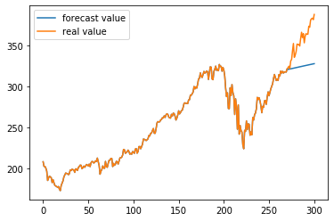
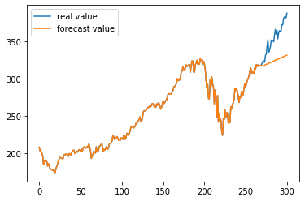
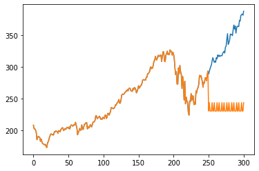

# 时间序列分析与机器学习方法预测效果对比

### 本文选用状态转移方程的5种函数和多元线性回归和K近邻算法对股票价格进行预测对比

## 首先进行状态转移方程的预测


```python
import numpy as np
import pandas as pd
from math import exp
from scipy.optimize import minimize
from math import pi
```

#### 定义一个评价标准的函数


```python
def mape(y_true, y_pred):
    return np.mean(np.abs((y_pred - y_true) / y_true)) * 100
```


```python
def ForecastARkf(y,h):# 多误差来源AR模型 用卡尔曼滤波进行测试
    n=len(y)
    a=np.zeros(n)
    p=np.zeros(n)
    a[0]=y[0]
    p[0]=10000
    k=np.zeros(n)
    v=np.zeros(n)
    z=1
    def funcTheta(X):
        w=1-exp(-abs(X[2]))
        q=abs(X[0])
        co=abs(X[1])
        likelihood=0
        sigmae=0
        for t in range(1,n):
        
            k[t]=(z*w*p[t-1])/(z**2*p[t-1]+1)#卡尔曼滤波部分
            p[t]=w**2*p[t-1]-w*z*k[t]*p[t-1]+q
            v[t]=y[t]-z*a[t-1]
            a[t]=co+w*a[t-1]+k[t]*v[t]
            sigmae=sigmae+(v[t]**2/(z**2*p[t-1]+1))
            likelihood=likelihood+.5*np.log(2*pi)+.5+.5*np.log(z**2*p[t-1]+1)

        likelihood=likelihood+.5*n*np.log(sigmae/n) 
        return likelihood
    res = minimize(funcTheta, [0.5,10,2])
    q=abs(res.x[0])
    co=abs(res.x[1]);
    w=1-exp(-res.x[2])
    sigmae=0
    for t in range(1,n):
        k[t]=(z*w*p[t-1])/(z**2*p[t-1]+1)
        p[t]=w**2*p[t-1]-w*z*k[t]*p[t-1]+q
        v[t]=y[t]-z*a[t-1]
        a[t]=co+w*a[t-1]+k[t]*v[t]
        sigmae=sigmae+(v[t]**2/(z**2*p[t-1]+1))
  
    
    
    Forec=np.zeros(h)#预测部分
    Forec[0]=a[len(y)-1]
    for i in range(1,h):
        Forec[i]=co+w*Forec[i-1]
    
    return Forec

```


```python
def ForecastAR(y,h):# 单误差来源AR模型 用卡尔曼滤波进行预测
  
    state=np.zeros(len(y))
    v=np.zeros(len(y))
    state[0]=y[0]
    def logLikConc(myparam):
        w= 1-exp(-abs(myparam[0]))
        gamma=abs(myparam[1])
        co=abs(myparam[2])
        for t in range(1,len(y)): 
            v[t]=y[t]-state[t-1]
            state[t] =co+w*state[t-1]+gamma*v[t]
  
        return np.sum(v[:len(y)]**2)
    res = minimize(logLikConc, [2,.2,1])#求使均方误差最小参数
    w=1-exp(-abs(res.x[0]))
    gamma=abs(res.x[1])
    co=abs(res.x[2])
  
    for t in range(1,len(y)): 
        v[t]=y[t]-state[t-1]
        state[t] =co+w*state[t-1]+gamma*v[t]#生成序列
  
  
    Forec=np.zeros(h)
    Forec[0]=state[len(y)-1]
    for i in range(1,h):
        Forec[i]=co+w*Forec[i-1]
  
    return Forec

```


```python
def ForecastThetakf(y,h):#y是要预测的序列，h是预测步长
    #多误差来源 Theta Method 模型
    n=len(y)
    a=np.zeros(n)
    p=np.zeros(n)
    a[0]=y[0]
    p[0]=10000
    k=np.zeros(n)
    v=np.zeros(n)

    def funcTheta(parameters):
        q=abs(parameters[0])
        co=abs(parameters[1])
        z=1
        w=1
        likelihood=0
        sigmae=0
        for t in range(1,n):
        
            k[t]=(z*w*p[t-1])/(z**2*p[t-1]+1)
            p[t]=w**2*p[t-1]-w*z*k[t]*p[t-1]+q
            v[t]=y[t]-z*a[t-1]
            a[t]=co+w*a[t-1]+k[t]*v[t]
            sigmae=sigmae+(v[t]**2/(z**2*p[t-1]+1))
            likelihood=likelihood+.5*np.log(2*pi)+.5+.5*np.log(z**2*p[t-1]+1)

        likelihood=likelihood+.5*n*np.log(sigmae/n) 
        return likelihood
    result=minimize(funcTheta, [.3,1])
    w=1
    z=1
    q=abs(result.x[0])
    co=abs(result.x[1]); 
  
  
    for t in range(1,len(y)):
        k[t]=(z*w*p[t-1])/(z**2*p[t-1]+1)
        p[t]=w**2*p[t-1]-w*z*k[t]*p[t-1]+q
        v[t]=y[t]-z*a[t-1]
        a[t]=co+w*a[t-1]+k[t]*v[t]
  
  
    Forecast=np.zeros(h)
    Forecast[0]=a[-1]
    for i in range(1,h):
        Forecast[i]=co+Forecast[i-1];
  
    return Forecast
```


```python
def ForecastTheta(y,h):#h为预测步长
  #单误差来源Theta Method模型
    state=np.zeros(len(y))
    v=np.zeros(len(y))
    state[0]=y[0]
    def logLikConc(myparam):
        w=1
        gamma=abs(myparam[0])
        co=abs(myparam[1])
        for t in range(1,len(y)):
            v[t]=y[t]-state[t-1]
            state[t] =co+w*state[t-1]+gamma*v[t]
  
        return np.sum(v[:len(y)]**2)
    result=minimize(logLikConc, [.3,1])
    w=1
    gamma=abs(result.x[0])
    co=abs(result.x[1]); 
  
    for t in range(1,len(y)):
        v[t]=y[t]-state[t-1]
        state[t] =co+w*state[t-1]+gamma*v[t]
  
  
    Forec=np.zeros(h)
    Forec[0]=state[len(y)-1]
    for i in range(1,h):
        Forec[i]=co+w*Forec[i-1]
  
    return Forec

```


```python
def ForecastDamped(y,h):#y是待预测序列 h是预测步长
  #单误差阻尼模型
    obs=len(y)
    damped=np.zeros((obs,2))
    damped[0][0]=y[1]
    damped[0][1]=0  
    inn=np.zeros(obs)  
    def fmsoe(param):
        k1=abs(param[0])
        k2=abs(param[1])
        k3=abs(param[2])
        for t in range(1,obs) :
            inn[t]=y[t]-damped[t-1][0]-k3*damped[t-1][1]
            damped[t][0] = damped[t-1][0]+k3*damped[t-1][1]+k1*inn[t]
            damped[t][1] = k3*damped[t-1][1]+k2*inn[t]   
  
        return np.sum(inn[:obs]**2)/obs
  
    result=minimize(fmsoe,np.random.rand(3))  
    k1=abs(result.x[0])
    k2=abs(result.x[1])
    k3=abs(result.x[2])
    if k3>1:
        k3=1
    for  t in range(1,obs):    
        inn[t]=y[t]-damped[t-1][0]-k3*damped[t-1][1]
        damped[t][0] = damped[t-1][0]+k3*damped[t-1][1]+k1*inn[t]
        damped[t][1] = k3*damped[t-1][1]+k2*inn[t]
  
    Forecast=np.zeros(h)
    Forecast[0]=damped[obs-1][0]+k3*damped[obs-1][1]
    for i in range(1,h):
        Forecast[i]=Forecast[i-1]+damped[obs-1][1]*k3**i
  
    return Forecast
```


```python
import warnings
warnings.filterwarnings("ignore")
if __name__ == '__main__':    
    MAPE_ARkf=[]
    MAPE_AR=[]
    MAPE_THkf=[]
    MAPE_TH=[]
    MAPE_Damp=[]#每种方法的MAPE     
    for d in range(30):#选取前30列数据
        df = pd.read_excel('portfolio.xlsx')
        data=pd.DataFrame(df[df.columns[d]].copy())
        data=np.array(data)
        h=30
        y=data[:-h]# h是要预测的步长
        y_real=data[-h:]
        MAPE_ARkf.append(mape(y_real,ForecastARkf(y,h)))#对每一列数据都用着五种方法预测，分别记录这MAPE值
        MAPE_AR.append(mape(y_real,ForecastAR(y,h)))
        MAPE_THkf.append(mape(y_real,ForecastThetakf(y,h)))
        MAPE_TH.append(mape(y_real,ForecastTheta(y,h)))
        MAPE_Damp.append(mape(y_real,ForecastDamped(y,h)))
```

#### 可以以第一个公司为例，画一下预测的图形


```python
df = pd.read_excel('portfolio.xlsx')
data=pd.DataFrame(df[df.columns[1]].copy())
data=np.array(data)
h=30
y=data[:-h]# h是要预测的步长
y_real=data[-h:]
s=np.append(y,y_real)
m=np.append(y,ForecastARkf(y,h))
plt.plot(m,label="forecast value")
plt.plot(s,label="real value")
plt.legend()
plt.show()
```





```python
print(MAPE_TH)
```

    [3.9404009033166225e-09, 1.3268238813995419, 1.029501707953053, 1.7455998841372469, 0.9368812483275649, 4.024099583910729, 3.498648896974236, 1.6036721401393381, 1.111331303624158, 0.4074389072619056, 1.0379931158947544, 1.4235831658853686, 2.4564239563068093, 0.03326415095038987, 1.5263864646779086, 0.48131808655683683, 0.5076718086193314, 1.4781809028188715, 0.20313295767544567, 3.3211410611237584, 4.112853196820189, 4.729136501033939, 1.5140891415411792, 1.7780983963515455, 1.6889694182882418, 1.3495252566555311, 4.003149651799075, 1.2453640308131655, 0.521725230179828, 0.39427600408606933]
    


```python
print(MAPE_ARkf)
```

    [1.7464817192890028e-05, 1.3285018987932762, 1.102928026065834, 2.1270015433812945, 1.2283341069021219, 4.005959562548982, 3.4742435571115067, 1.0821881524053507, 1.3275514549684133, 1.0112410125075484, 0.8297951842256512, 1.1547133878581501, 2.3937411964161486, 0.41776704570558304, 1.6139661018873965, 0.35615634634394683, 0.4715755078874593, 1.8334931253939761, 0.23180834245802381, 3.218620603491609, 4.244192115464887, 4.606765648039517, 1.7204525251622507, 2.0678713257650125, 1.5872895615300915, 1.7318055458778476, 4.135472345775371, 1.5844607211228032, 0.04459941648860339, 0.4264438121397648]
    

#### 由此可见 TimeSeries的结果并不稳定，对于不同的公司选取不同的状态转移函数，得到的结果差距较大。

## 机器学习的方法

### 多元线性回归


```python
import pandas as pd
import numpy as np
import matplotlib.pyplot as plt
from matplotlib.pylab import rcParams
rcParams['figure.figsize'] = 20,10
from sklearn.preprocessing import MinMaxScaler
from sklearn import neighbors
from sklearn.model_selection import GridSearchCV
from sklearn.preprocessing import MinMaxScaler
```


```python
scaler = MinMaxScaler(feature_range=(0, 1))
df = pd.read_excel('portfolio.xlsx')
data = df.sort_index(ascending=True, axis=0)
```

#### 这里创建一个新的特征，根据距离第一天的日子除7以后是0或者4赋值1，否则为0，以此检测其周期性


```python
# 创建独立的数据集
df=np.array(df)
new_data=np.ones([3,len(data)])
for i in range(0,len(data)):
    new_data[0][i] = df[i][0]
    new_data[1][i] = df[i][1]
for i in range(0,len(data)):
    if int(new_data[0][i] %7) ==0 or int(new_data[0][i]%7)==4:
        new_data[2][i] = 1
    else:
        new_data[2][i] = 0
```

#### 这里开始拆分训练集和验证集


```python
train = new_data[:,0:270]
valid = new_data[:,270:]
y_train = train[1]
x_train = np.delete(train,1, axis=0)
y_valid = valid[1]
x_valid = np.delete(valid,1, axis=0)
```

#### 实现线性回归模型


```python
s=x_train[0].reshape(-1,1)
from sklearn.linear_model import LinearRegression
model = LinearRegression()
model.fit(s,y_train)
t=x_valid[0].reshape(-1,1)
preds = model.predict(t)
rms = np.sqrt(np.mean(np.power((np.array(y_valid)-np.array(preds)),2)))
MAS=mape(preds,y_valid)
print(MAS)
s=np.append(y_train,preds)
plt.plot(new_data[1],label="real value")
plt.plot(s,label="forecast value")
plt.legend()
plt.show()
```

    9.316888836300606
    





#### 得到的结果的MAPE的值达到了9.31，从图像上看，结果不如时间序列的效果

### 利用近邻算法计算效果


```python
from sklearn import neighbors
from sklearn.model_selection import GridSearchCV
from sklearn.preprocessing import MinMaxScaler
scaler = MinMaxScaler(feature_range=(0, 1))
x_train_scaled = scaler.fit_transform(x_train[1].reshape(-1,1))
x_train = pd.DataFrame(x_train_scaled)
x_valid_scaled = scaler.fit_transform(x_valid[1].reshape(-1,1))
x_valid = pd.DataFrame(x_valid_scaled)

# 使用gridsearch查找最佳参数
params = {'n_neighbors':[2,3,4,5,6,7,8,9]}
knn = neighbors.KNeighborsRegressor()
model = GridSearchCV(knn, params, cv=5)

# 拟合模型并进行预测
model.fit(x_train,y_train)
preds = model.predict(x_valid)
# rmse
rms = np.sqrt(np.mean(np.power((np.array(y_valid)-np.array(preds)),2)))
print("这时候的rms为"+str(rms))
# 图表
s=np.append(y_train,preds)


plt.plot(new_data[1])
plt.plot(s)
plt.show()
```

    这时候的rms为106.22830637367696
    





#### 利用近邻算法得到的结果与真实值差异更大，因为，选取时间序列分析状态转移方程的方法，得到的结果是最优的。
